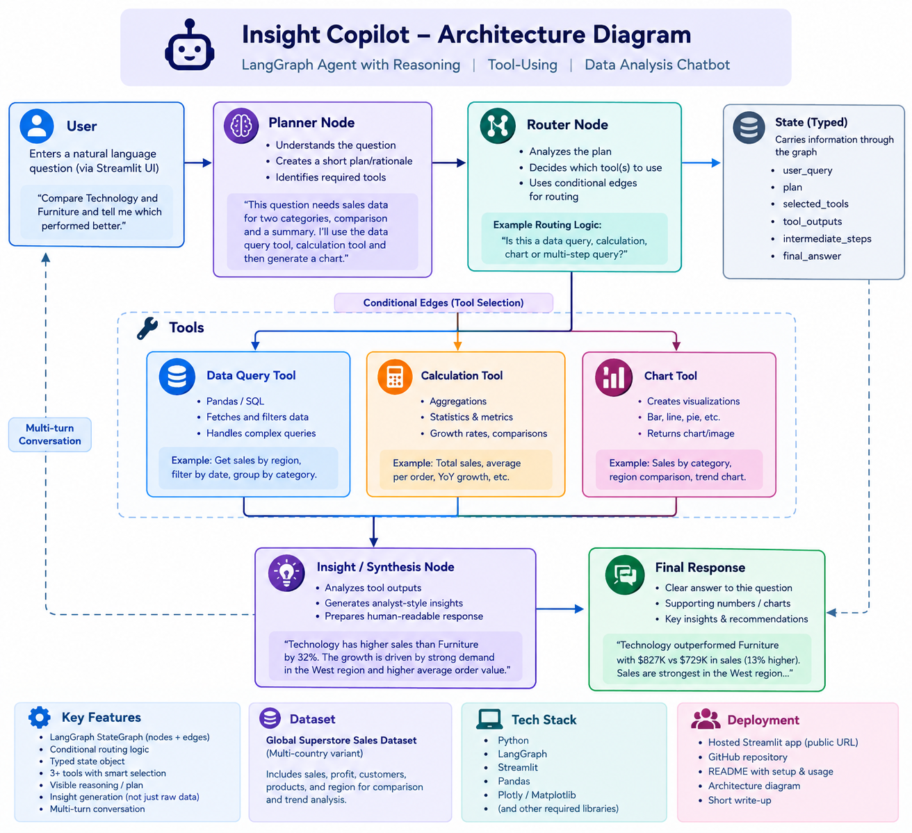
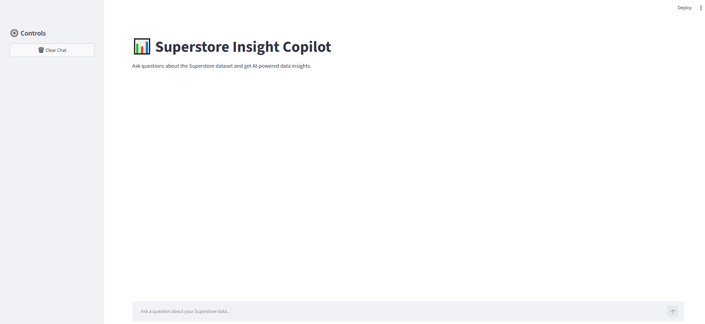
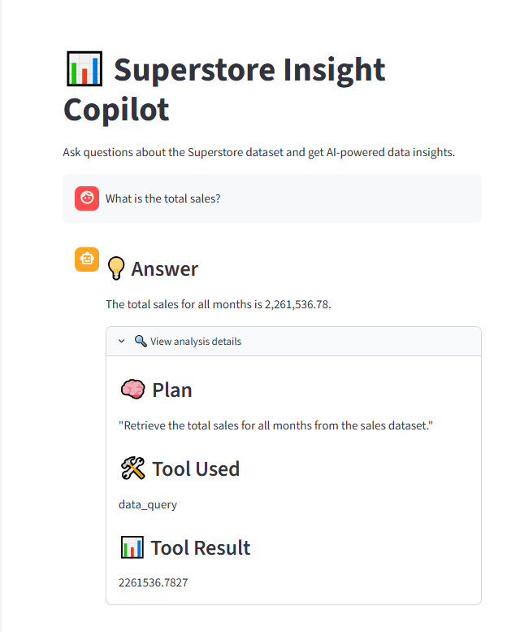
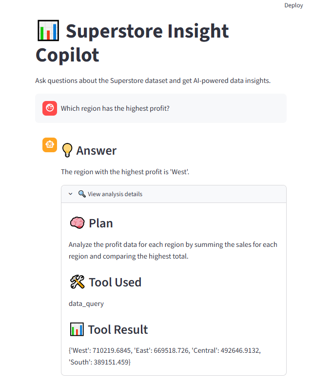
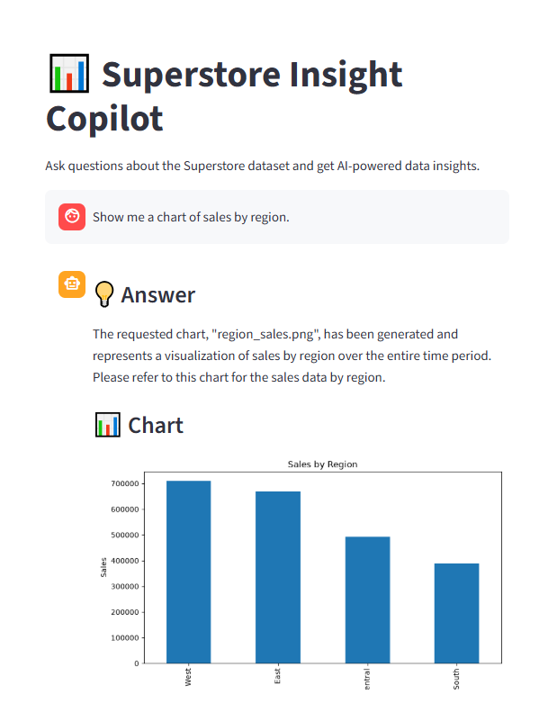

# 📊 Superstore Insight Copilot

An AI-powered data analysis chatbot built with **Python, LangGraph, LangChain, Ollama/Mistral, and Streamlit**.

Superstore Insight Copilot allows users to ask natural-language questions about the Superstore sales dataset and receive analytical answers, calculations, comparisons, visualizations, and business-oriented insights.

The project demonstrates a **reasoning and tool-using agent architecture** using LangGraph.

---

## 🚀 Features

- Natural-language data analysis
- LangGraph-based agent orchestration
- Planner and routing logic
- Conditional tool selection
- Data Query Tool
- Calculation Tool
- Chart / Visualization Tool
- Visible reasoning / analysis plan
- Analyst-style final insights
- Multi-turn conversation with previous context
- Interactive Streamlit chatbot interface
- Dataset-based business analysis
- Graceful handling of unsupported questions

---

## 🏗️ Architecture

The application uses **LangGraph** to orchestrate a reasoning and tool-using data analysis agent.

The general workflow is:

**User Question → Planner → Router → Tool → Analysis / Insight → Final Answer**

The agent first interprets the user's question and creates a short plan. A routing step then determines which tool is appropriate for the requested task. The tool processes the Superstore dataset, after which the agent converts the results into a concise analytical response.

### Architecture Diagram



---

## 🧠 Agent Workflow

1. **User Question**The user enters a natural-language question through the Streamlit interface.
2. **Planning / Reasoning**The agent analyzes the question and creates a short execution plan.
3. **Conditional Routing**The LangGraph workflow determines which tool is appropriate for the question.
4. **Tool Execution**The selected analytical tool processes the Superstore dataset.
5. **Insight Generation**Tool results are interpreted and converted into a human-readable analytical response.
6. **Final Answer**The user receives a direct answer with supporting numbers and relevant insights.
7. **Multi-turn Context**
   Previous conversation context can be used when answering follow-up questions.

---

## 🛠️ Tools

### 1. Data Query Tool

Used to retrieve, filter, group, and analyze information from the Superstore dataset.

Examples:

- Total sales
- Sales by region
- Sales by category
- Top products
- Dataset-level filtering and aggregation

### 2. Calculation Tool

Used for numerical and statistical calculations.

Examples:

- Total sales
- Average sales per order
- Sales growth
- Comparisons
- Other supported analytical metrics

### 3. Chart Tool

Used to generate visualizations for analytical questions.

Examples:

- Category sales
- Regional sales
- Monthly sales trends
- Other supported visual comparisons

---

## 📊 Insight Generation

The chatbot is designed to provide more than raw values.

Responses aim to include:

- A direct answer
- Supporting numerical results
- Relevant comparisons
- A concise analytical interpretation
- A "why this matters" or standout insight when appropriate

For example, instead of only returning a numerical result, the agent can explain what the result indicates about sales performance.

---

## 📷 Screenshots

### Main Interface



### Data Query



### Calculation



### Visualization



---

## 📊 Dataset

The project uses the **Superstore sales dataset** for business data analysis and insight generation.

The dataset contains sales-related information that can be used for:

- Regional analysis
- Category analysis
- Product analysis
- Sales trends
- Aggregations and comparisons

---

## 💻 Tech Stack

| Technology | Purpose                          |
| ---------- | -------------------------------- |
| Python     | Core application development     |
| LangGraph  | Agent workflow and orchestration |
| LangChain  | LLM/tool integration             |
| Ollama     | Local LLM runtime                |
| Mistral    | Language model                   |
| Streamlit  | Chatbot interface                |
| Pandas     | Data processing                  |
| NumPy      | Numerical operations             |
| Matplotlib | Data visualization               |

---

## ⚙️ Installation

### 1. Clone the repository

```bash
git clone https://github.com/PreranaSangar/superstore-insight-copilot.git
cd superstore-insight-copilot
```

### 2. Create and activate a virtual environment

```bash
python -m venv venv
```

Windows PowerShell:

```powershell
venv\Scripts\Activate.ps1
```

### 3. Install dependencies

```bash
pip install -r requirements.txt
```

### 4. Configure Ollama / Mistral

Make sure Ollama is installed and the required Mistral model is available locally.

For example:

```bash
ollama pull mistral
```

### 5. Run the application

```bash
streamlit run app.py
```

The application will open through the Streamlit interface.

---

## 🧪 Testing

The application was tested using different categories of analytical questions, including:

- Basic data queries
- Aggregations and calculations
- Category comparisons
- Regional comparisons
- Sales trends
- Chart generation
- Follow-up questions
- Multi-step analytical questions
- Unsupported questions and edge cases

Example questions include:

```text
What is the total sales?

What are the total sales for each region?

What are the total sales for each category?

What is the average sales per order?

What is the sales growth?

Show me a chart of sales by region.
```

---

## ⚠️ Known Limitations

- The chatbot is primarily designed for questions related to the provided Superstore dataset.
- Answers depend on the quality and structure of the dataset.
- Complex questions outside the implemented tools may not be supported.
- The current LLM runs locally through Ollama.
- Local model performance depends on available system resources.
- The current implementation supports a defined set of analytical tools and operations.

---

---

## 📝 Design Decisions & Trade-offs

### Design Decisions

The project was designed around a **LangGraph-based agent architecture** so that the chatbot can reason about a user's question before selecting an appropriate analytical tool. A planner node creates a short execution plan, while a router node uses conditional routing to select between the Data Query Tool, Calculation Tool, and Chart Tool.

A typed state object is used to carry information through the graph, making the workflow structured and easier to maintain. The final-answer stage converts tool results into concise, analyst-style responses instead of directly exposing raw tool output.

The application uses **Mistral through Ollama** to keep the development environment local and avoid exposing API keys during development. Streamlit was selected for the user interface because it provides a simple way to build an interactive data-analysis chatbot.

### Trade-offs

Using a local LLM through Ollama provides better control over data and avoids external API costs, but model performance depends on the available CPU, RAM, and other local system resources.

The current implementation uses a defined set of analytical tools rather than allowing unrestricted code execution. This improves control and reduces the risk of unsupported operations, but it also limits the range of questions the chatbot can answer.

The project focuses on the Superstore dataset rather than supporting arbitrary datasets. This makes the tools and calculations more reliable for the demonstrated use cases while reducing generality.

## 🔍 Assumptions

- The Superstore dataset contains the required fields for supported sales analysis.
- Users primarily ask questions related to the provided dataset.
- The implemented tools cover the main analytical use cases demonstrated by the project.
- The local Mistral model is available through Ollama when running the application locally.

---

## 📌 Future Improvements

- Add more advanced statistical analysis
- Add additional visualization types
- Support additional datasets
- Add cloud / API-based LLM support
- Improve complex multi-step tool execution
- Add more sophisticated agent memory
- Improve anomaly detection
- Add scalable cloud deployment
- Add additional business intelligence capabilities

---

## 👤 Project

**Superstore Insight Copilot**

Built as a **GenAI / LLM / Agentic AI project** demonstrating:

- LangGraph-based agent orchestration
- Reasoning and planning
- Conditional tool selection
- Data analysis
- Visualization
- Insight generation
- Multi-turn conversational analysis
- Streamlit-based chatbot interaction
